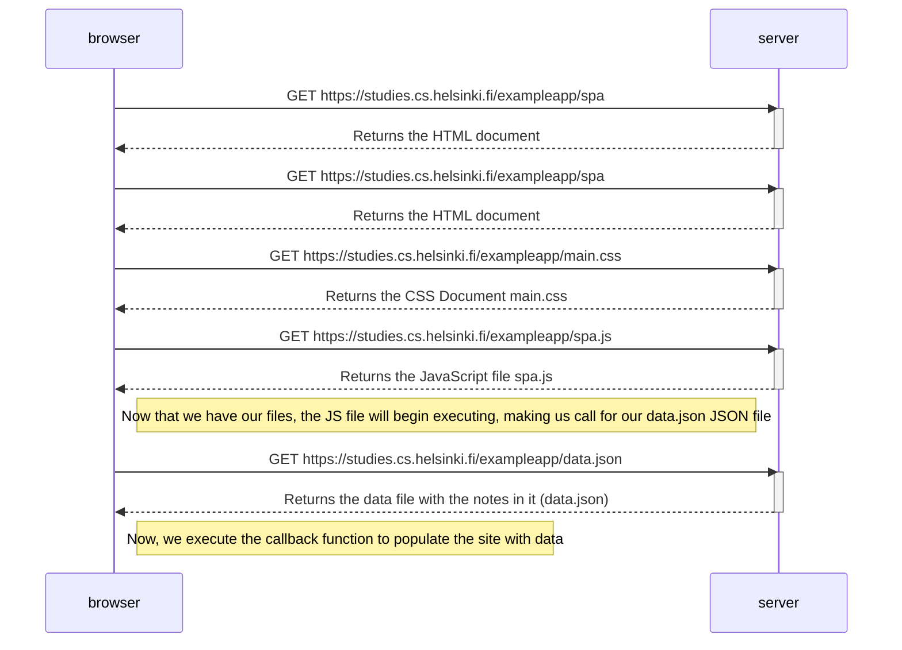

```mermaid
sequenceDiagram
participant browser
participant server

 browser->>server: GET https://studies.cs.helsinki.fi/exampleapp/spa
    activate server
    server-->>browser: Returns the HTML document
    deactivate server

 browser->>server: GET https://studies.cs.helsinki.fi/exampleapp/spa
    activate server
    server-->>browser: Returns the HTML document
    deactivate server

 browser->>server: GET https://studies.cs.helsinki.fi/exampleapp/main.css
    activate server
    server-->>browser: Returns the CSS Document main.css
    deactivate server


 browser->>server: GET https://studies.cs.helsinki.fi/exampleapp/spa.js
    activate server
    server-->>browser: Returns the JavaScript file spa.js
    deactivate server

Note right of browser: Now that we have our files, the JS file will begin executing, making us call for our data.json JSON file

browser->>server: GET https://studies.cs.helsinki.fi/exampleapp/data.json
    activate server
    server-->>browser: Returns the data file with the notes in it (data.json)
    deactivate server

Note right of browser: Now, we execute the callback function to populate the site with data
```
