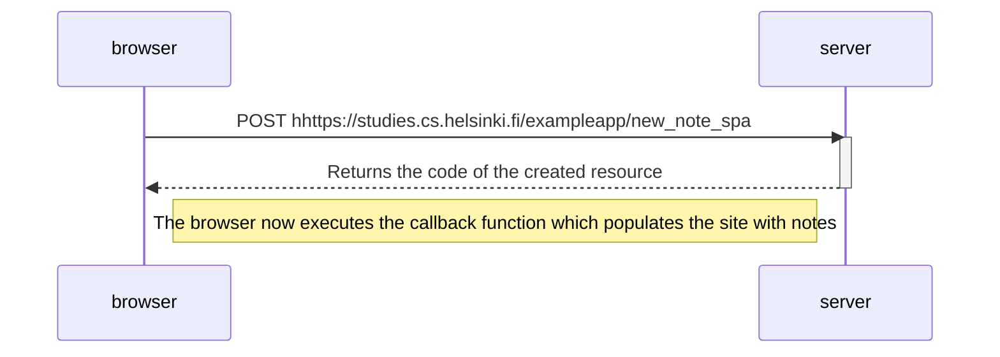

```mermaid
sequenceDiagram
participant browser
participant server

 browser->>server: POST hhttps://studies.cs.helsinki.fi/exampleapp/new_note_spa
    activate server
    server-->>browser: Returns the code of the created resource
    deactivate server

Note right of browser: The browser now executes the callback function which populates the site with notes
```
